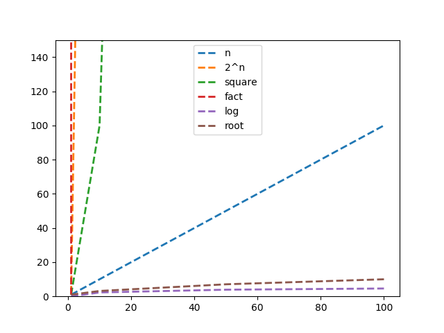
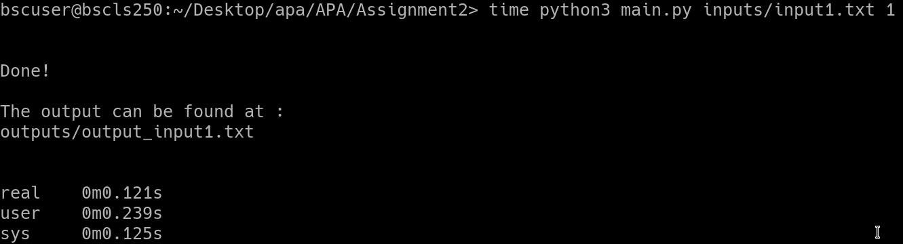
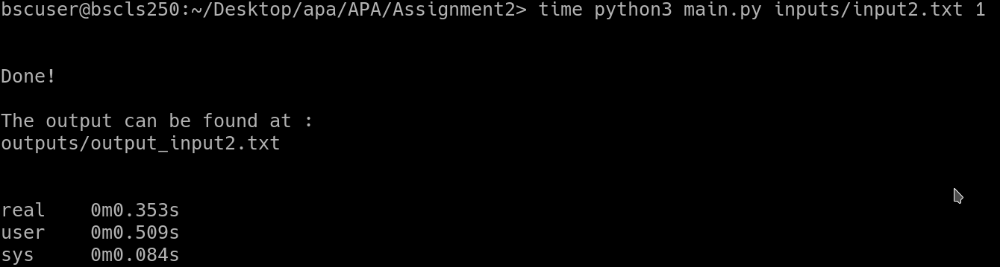
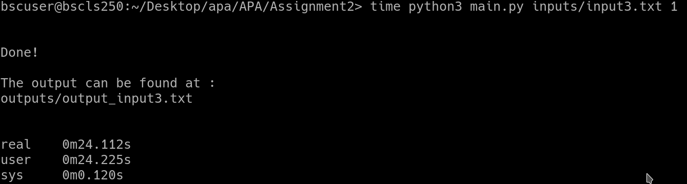
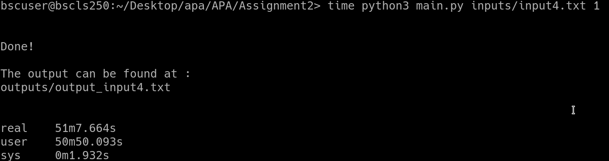

# Advanced Programming Course
Exercises and Project of the APA class

## Assignment 1

## Assignment 2

The performance of the code was tested on: 
Intel(R) Xeon(R) E-2124 CPU @ 3.30GHz

### Input1

### Input2

### Input3

### Input4

### Input5

